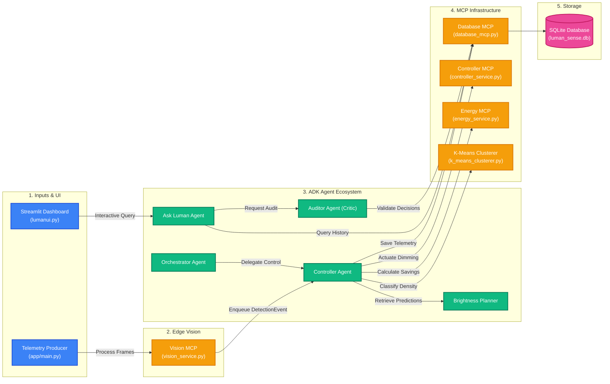
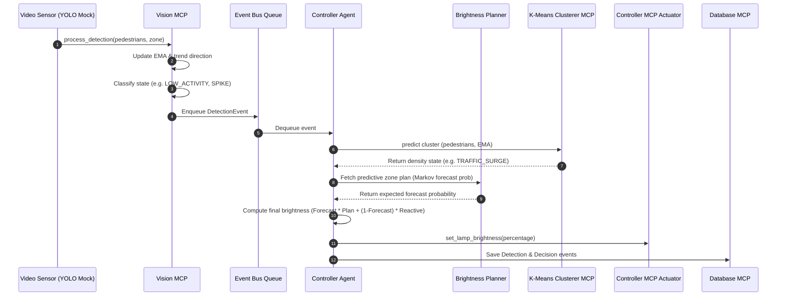

# LumanSense 💡

LumanSense is an adaptive municipal street-lighting control system. It utilizes Edge AI, Multi-Agent Coordination, and Model Context Protocol (MCP) services to optimize the urban energy footprint while prioritizing public safety. By analyzing real-time pedestrian flow telemetry, the system dynamically dims or brightens streetlights.

---

## 📖 The Problem

Traditional municipal street-lighting systems operate on static timers or basic photocells, keeping lights at 100% brightness throughout the night. This approach leads to:
1. **High Energy Waste**: Heavy power consumption during late-night or low-traffic hours when streets are empty.
2. **Shortened Equipment Lifespans**: Constant maximum-power operations degrade LED components faster.
3. **Public Safety Concerns**: Arbitrary dimming schedules can leave zones pitch-black when pedestrians or vehicles are actually present, increasing security risks.

---

## 🚀 The Solution

LumanSense addresses these issues through **predictive and reactive street-lighting control**:
* **Reactive Actuation**: Dims or brightens streetlights in real-time based on current pedestrian detections classified using hysteresis filters (e.g., normal activity, spikes, clearing, low activity).
* **Predictive Planning**: Leverages a Markov Chain model to forecast pedestrian transition probabilities across zones (e.g., if a pedestrian enters Zone A, they are likely to transition to Zone B in future steps) and establishes a proactive brightness schedule.
* **Intelligent Actuation Blending**: Combines predictive forecasts and real-time reactive signals to compute the optimal brightness percentage:

$$
\text{Brightness}_{\text{lamp}} = (\text{Forecast}_{\text{prob}} \times \text{Brightness}_{\text{plan}}) + ((1 - \text{Forecast}_{\text{prob}}) \times \text{Brightness}_{\text{reactive}})
$$
* **Traffic Density Clustering**: Employs K-Means clustering (`k-means-clusterer-mcp`) to classify traffic densities (`LOW_TRAFFIC`, `PEAK_TRAFFIC`, `TRAFFIC_SURGE`, etc.) by comparing current footfalls against exponential moving averages (EMA).
* **AI-Assisted Operations**: Features an interactive Natural Language chat assistant enabling municipal operators to check metrics, forecast distributions, and audit decisions.

---

## 🏗️ Architecture

LumanSense is built using the **Google ADK (Agent Development Kit)** and a series of **FastMCP servers** that decouple database access, machine learning clustering, and hardware simulation.

### System Architecture Block Diagram


### ADK Agents
1. **Orchestrator Agent** ([orchestrator_agent.py](app/agent/orchestrator_agent.py)): Acts as the Environmental Coordinator. Routes real-time telemetry inputs to the dimming controller.
2. **Controller Agent** ([controller_agent.py](app/agent/controller_agent.py)): The core loop coordinator. Processes queued detection events, queries plans, makes dimming decisions, and actuates physical brightness levels.
3. **Brightness Planner Agent** ([brightness_planner_agent.py](app/agent/brightness_planner_agent.py)): Computes multi-step ahead transition probability forecasts across zones using historical matrices.
4. **Ask Luman Agent** ([ask_luman_agent.py](app/agent/ask_luman_agent.py)): Enables natural language querying of database records, state distributions, and overall energy savings.
5. **Lighting Auditor Agent** ([luman_sense_critic_agent.py](app/agent/luman_sense_critic_agent.py)): A critique agent that audits recent lighting dimming actions to verify if safety standards were maintained.

### MCP Tools & Services
* **VisionMCP** ([vision_service.py](app/mcp/vision_service.py)): Classifies raw video frames (pedestrian count, timestamp, zone) into discrete activity states using hysteresis filters.
* **DatabaseMCP** ([database_mcp.py](app/mcp/database_mcp.py)): Manages the SQLite database operations (`luman_sense.db`).
* **ControllerMCP** ([controller_service.py](app/mcp/controller_service.py)): Mock hardware interface for adjusting lamp brightness.
* **EnergyMCP** ([energy_service.py](app/mcp/energy_service.py)): Computes estimated energy savings relative to a baseline brightness level (defaults to 90%).
* **K-Means Clusterer MCP** ([k_means_clusterer.py](app/mcp/k_means_clusterer.py)): Clusters pedestrian-EMA feature vectors to identify specific traffic congestion patterns.

---

## 📋 Data Schema

LumanSense stores its operational logs in a local SQLite file: `luman_sense.db`.

### 1. `detection_events`
Tracks incoming pedestrian data and classifications:
* `timestamp` (TEXT)
* `zone` (TEXT)
* `pedestrians` (INTEGER)
* `ema` (REAL)
* `trend_label` (TEXT)
* `zone_occupancy_forecast` (REAL)
* `delta_occupancy` (REAL)
* `cluster_label` (TEXT)

### 2. `decision_events`
Tracks dimming actuations and performance details:
* `timestamp` (TEXT)
* `zone` (TEXT)
* `state` (TEXT)
* `pred_brightness` (INTEGER)
* `reactive_brightness` (INTEGER)
* `brightness` (INTEGER) (Final Actuation)
* `energy_saved_watts` (INTEGER)
* `reason` (TEXT)

---

## 📊 Training Data

The predictive Markov models and K-Means traffic clustering algorithms in LumanSense are trained using a historical traffic dataset.
* **File Location**: [traffic.csv](app/training-dataset/traffic.csv)
* **Data Mapping**: The dataset details vehicle counts collected at hourly intervals across multiple junctions:
  * Junction 1 -> **Zone A**
  * Junction 2 -> **Zone B**
  * Junction 3 -> **Zone C**
  * Junction 4 -> **Zone D**
* **Usage**: Used to compute hourly state transition probabilities and configure the five-cluster centroids (`LOW_TRAFFIC`, `CLEARING_TRAFFIC`, `MODERATE_TRAFFIC`, `TRAFFIC_SURGE`, `PEAK_TRAFFIC`) based on raw count and EMA baseline features.

---

## 🔄 Real-Time Control Loop Flow



---

## 🛠️ Setup Instructions

### Prerequisites
* Python version `3.11` to `3.13`
* `uv` (fast Python package manager)
* `google-agents-cli` (installed with `uv tool install google-agents-cli`)
* Valid GCP credentials and `GEMINI_API_KEY` set in your `.env` file.

### Installation
1. Clone the repository and navigate to the project directory:
   ```bash
   cd luman-sense
   ```
2. Install packages and set up dependencies:
   ```bash
   agents-cli install
   ```

---

## 🏃 Running LumanSense

### 1. Run the Control Loop Simulation
Executes the pedestrian telemetry generator (`yolo_mock_producer`) and drives the automated street-lighting coordinator over the scenarios:
```bash
uv run python -m app.main
```

### 2. Run the Streamlit Dashboard
Launches the Web UI containing real-time traffic statistics charts and the interactive **Ask LumanSense** AI Assistant portal:
```bash
uv run streamlit run lumanui.py
```

### 3. Local Development Playground
Launch the local `agents-cli` interactive developer playground to test agent routing and tool call logic manually:
```bash
agents-cli playground
```

---

## 📚 Citations & Data Sources

This project uses the following datasets for training and simulation logic:
* **Traffic Prediction Dataset**: fedesoriano. (2021). *Traffic Prediction Dataset*. Kaggle. Available at: [https://www.kaggle.com/datasets/fedesoriano/traffic-prediction-dataset](https://www.kaggle.com/datasets/fedesoriano/traffic-prediction-dataset)
